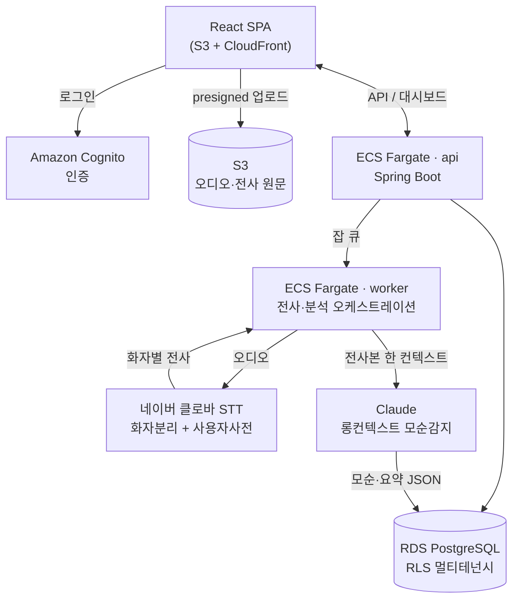

# meeting-tracker — 회의 흐름·모순 추적기

> 회의 녹음을 올리면, **요약을 넘어 "회의 중 말이 뒤바뀐 지점"**을 잡아내는 대시보드.

회의는 길고, 사람은 자기가 30분 전에 한 말을 잊는다. 예산 "3천만원"이 어느새 "2천만원"이 되고,
"8월 출시 확정"이 슬그머니 "9월"이 된다. 기존 회의요약 툴(Otter·Fireflies·클로바노트 등)은
"녹음 → 텍스트 요약"에 머물러 **이 흐름의 균열을 못 잡는다.** meeting-tracker의 핵심은 요약이 아니라
**"흐름·모순 추적기(Flow & Contradiction Tracker)"** — 회의 처음과 끝처럼 멀리 떨어진 발언을
대조해 균열을 짚어낸다.

> ⚙️ **상태**: 설계 확정 · 벤치마크 3종 — STT 측정 코어 [`benchmarks/stt/`](benchmarks/stt/) · 감지 품질+실측 [`benchmarks/detection/`](benchmarks/detection/) · 통계 판정층 [`benchmarks/stats/`](benchmarks/stats/)
> 📄 제품 구상·감지 정의 [`docs/spec.md`](docs/spec.md) · 데이터 계약 [`docs/data-schema.json`](docs/data-schema.json)
> 🧭 진행 관리: 계획 [`plan.md`](plan.md) · 작업 로그 [`changeLog.md`](changeLog.md) · 함정 기록 [`troubleshooting.md`](troubleshooting.md)

---

## 감지하는 것 — 흐름 균열 4종

| 유형 | 뜻 | 예시 |
|---|---|---|
| **모순** | 같은 사람이 앞뒤로 다른 말 | 예산 "3천만원" → 나중에 "2천만원" |
| **번복** | 확정했던 결정이 조용히 뒤집힘 | "8월 출시 확정" → 끝에 "9월" |
| **미해결** | 꺼내놓고 다시 안 다룬 안건 | "사전예약 이벤트 뒤에서 얘기하자" → 안 다룸 |
| **재논의** | 이견이 결론 없이 넘어감 | 기능 스펙 방향 이견 봉합 안 됨 |

`모순`·`번복`은 정의상 **"같은 사람"**이 핵심 → 화자 분리(diarization)가 필수 입력.

---

## 보는 방식 — 회의를 "연결된 그래프"로  *(이 프로젝트의 출발점)*

이 프로젝트는 원래 **"회의를 어떻게 한눈에 연결해서 볼 수 있을까"**라는 질문에서 시작했다.
회의록은 선형이다 — 위에서 아래로 읽는다. 그런데 실제 대화는 선형이 아니다. 20분 전 안건이
41분에 되돌아오고, 멀리 떨어진 두 발언이 사실 같은 결정을 뒤집으며, 주제는 흩어졌다 다시 뭉친다.
**선형 스크립트는 이 구조를 숨긴다.**

그래서 회의를 **노드-링크 그래프**로 그린다 — 옵시디언 그래프 뷰처럼, 대화가 서로 연결된 하나의
지도가 된다. (옵시디언을 그대로 베끼는 게 아니라, **"연결을 눈으로 보는" 그 경험**이 핵심이다.)

- **노드** — 발언 묶음 · 주제 · 화자 · 결정/안건
- **링크**
  - 🔴 **모순·번복** — 멀리 떨어진 두 발언을 잇는 선. "말이 뒤바뀐 지점"이 그래프 위 다리처럼 드러난다.
  - **주제 클러스터** — 같은 주제의 발언이 뭉친다. 흩어졌다 다시 뭉치는 주제가 보인다.
  - **응답 관계** — 누가 누구 말에 반응했는가.
  - **결정 ↔ 근거/번복** — 결정 노드가 그걸 세운 발언과 뒤집은 발언으로 이어진다.
  - **고립 노드 = 미해결** — 꺼내놓고 어떤 결론과도 연결되지 않은 안건은 홀로 떠 있다.

감지 4종이 **엔진**이라면, 이 그래프는 그 결과를 **공간적으로 항해하는 방식**이다. 타임라인 리본이
*언제*를 보여준다면, 그래프는 *무엇이 무엇과 얽혀 있는가*를 보여준다.

> 🛠 데이터는 이미 만드는 분석 JSON 그대로 — **flags가 곧 엣지**, 발언·주제·화자·결정이 노드다.
> 노드-링크/포스 다이렉티드라 Recharts로는 안 되니 **React Flow** 또는 **force-directed**(d3-force /
> react-force-graph)를 그래프 전용 라이브러리로 둔다.

---

## 아키텍처



Spring이 **오케스트레이터**로서 상태머신(`UPLOADED→TRANSCRIBING→TRANSCRIBED→ANALYZING→DONE`)을
소유하고, 무거운 STT·LLM 작업은 외부 관리형 서비스로 오프로딩한다.

---

## 기술 스택

| 레이어 | 선택 | 한 줄 이유 |
|---|---|---|
| 프론트 | React · Vite · TS · Tailwind · shadcn/ui · Recharts · React Flow(그래프 뷰) | 프론트 비전공 → Claude가 가장 유창하게 생성·유지보수하는 조합 |
| 프론트 호스팅 | S3 + CloudFront (S3 + `/api/*`→ALB 두 오리진) | CORS 제거 + 정적 트래픽을 ECS에서 분리 |
| 인증 | Amazon Cognito (authN) + Postgres `memberships` (authZ) | 비밀번호·MFA·탈취방어 중노동을 외주, org별 권한은 DB |
| 백엔드 | Spring Boot on ECS Fargate + ALB | 오케스트레이터 역할, 컨테이너 오케스트레이션 학습가치 |
| STT | 네이버 클로바 (`SttPort`로 AWS Transcribe 스왑 가능) | 한국어 회의 정확도 최우선 (아래 근거) |
| 분석 | Anthropic Claude (롱컨텍스트 단일 패스 + quote grounding) | 멀리 떨어진 발언 대조엔 청킹 없는 단일 컨텍스트가 정석 |
| 데이터 | RDS PostgreSQL (RLS 멀티테넌시) + S3 | 앱이 `WHERE` 빠뜨려도 DB가 막는 이중 방어 |
| IaC / CI | Terraform + GitHub Actions (OIDC) | AWS+NCP 두 클라우드를 한 도구로, 장기키 0 |

---

## 핵심 기술 결정 (Why)

- **STT = 클로바** — 한국어 회의체에서 클로바가 우위: 평균 CER **클로바 7.5% vs AWS Transcribe 11.1%**,
  특히 '주요영역별회의' 데이터셋에서 **8.4% vs 26%**로 격차가 크게 벌어진다 (RTZR AI-Hub 벤치마크).
  회의체 구어의 숫자·고유명사 오인식이 모순감지 입력을 오염시키므로 STT 정확도가 최우선. 단 AWS 네이티브
  편의도 커서 `SttPort` 인터페이스로 추상화해 무중단 스왑 가능하게 둠.
- **분석 = Claude 롱컨텍스트 단일 패스** — 모순은 회의 처음↔끝의 far-apart 발언 대조라 청킹하면 못 잡는다.
  전사 전체를 한 컨텍스트에 넣고, 초장시간 회의만 "주장 원장(claim ledger)" 맵리듀스로 폴백.
- **환각 방지 = quote grounding** — Claude가 인용한 발언이 전사본에 **실제 존재하는지 사후 검증**하고,
  근거를 잃은 flag는 드롭. LLM이 없는 모순을 지어내면 제품 신뢰가 즉사하므로 필수 게이트.
- **멀티테넌시 = Postgres RLS** — 공유 스키마 + `org_id` + Row Level Security. 앱 버그로 `WHERE`를
  빠뜨려도 DB가 교차 테넌트 유출을 막는 방어심층.
- **오케스트레이션 = DB 상태머신 단일 진실원** — 전송 계층(폴러/콜백/SQS)이 바뀌어도 상태 모델은 고정.

---

## 리스크와 대응 (적대적 검증에서 도출)

설계를 낙관 없이 공격해 나온 핵심 리스크와 대응:

| 리스크 | 대응 |
|---|---|
| **STT 오염이 grounding을 통과** — 클로바가 3천→2천 오인식 시 두 발언 다 전사에 실재해 검증 통과, 가짜 모순 표시 | 숫자·금액 근거는 "확정" 아닌 **"확인 필요"**로 강등 + 근거 옆 **원문 오디오 재생 링크** 필수 |
| **분석 provider 단일 의존** — Claude 장애 시 제품 전체 다운 | `AnalysisPort` 추상화 + 서킷브레이커 + Batch 폴백 |
| **테넌트 비용 폭발** — 대량 업로드 시 STT·LLM 비용 무방비 | org별 쿼터 + 업로드 시점 예상비용 게이트 + 급증 알람 |
| **크로스클라우드 웹훅 위조** — 클로바 콜백은 무인증 공개 엔드포인트 | HMAC 서명 + nonce 리플레이 방지 + 추측불가 jobId |

---

## 구축 순서 (MVP 우선)

1. **STT 골든셋 벤치마크** — 실제 한국어 회의로 클로바 vs Transcribe 숫자·고유명사 정확도 실측 *(제품 성패 지점)* → 측정 코어 구현 [`benchmarks/stt/`](benchmarks/stt/)
2. **분석 품질 검증** — 완벽 전사본에 Claude 모순감지, per-type precision/recall 하네스 구축
3. **파이프라인 통합** — 단일 사용자·단일 ECS로 업로드→STT→분석 상태머신
4. **프론트 UX** — 타임라인 리본·상충 발언 비교·grounding 하이라이트
5. **멀티테넌시 + 인증** — Cognito + RLS + 테넌트별 비용 쿼터
6. **인프라 하드닝** — Terraform, api/worker 분리 + SQS/DLQ, blue/green

> 핵심 원칙: 제품의 신뢰는 가장 약한 고리(한국어 숫자 STT) 위에 헤드라인 기능(모순감지)을 얹은 구조라,
> **인프라를 짓기 전에 1·2단계로 두 핵심 가정을 먼저 깨본다.**

---

## 개발 셋업 (2대 기계: 데스크톱 + 랩탑)

- **코드 동기화**: git. `main` 직접 작업 금지 → 브랜치 → PR → 확인 → 머지.
- **비밀 관리**: git에 비밀 안 넣음. 단일 소스 = **AWS SSM Parameter Store**, 각 기계는
  `aws sso login`으로 당겨쓰기(기계 간 복사 금지). 변수 목록은 [`.env.example`](.env.example).
- **툴체인 고정**: JDK / Node 버전을 `.sdkmanrc` / `.nvmrc`로 커밋 (두 기계 재현성).

```bash
git clone https://github.com/Goospel/meeting-tracker.git
# JDK/Node 버전 맞추고 → aws sso login → 실행
```

---

*설계는 Claude Code와의 협업으로 정리 — STT 실측 비교, 서브시스템별 아키텍처 설계, 적대적 검증을 거쳐 확정.*
